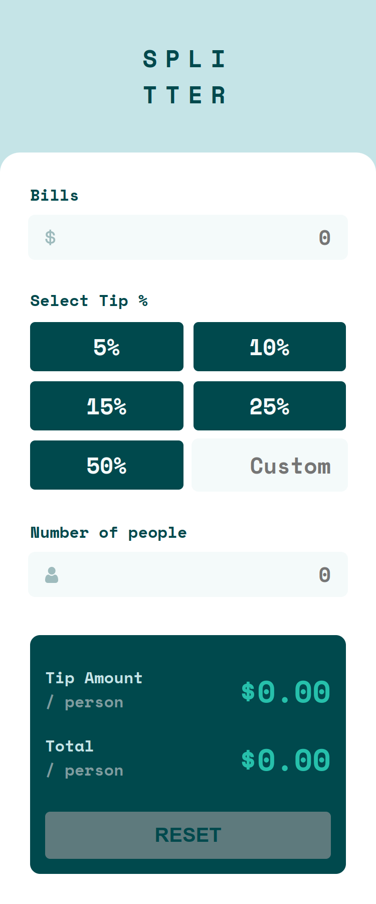
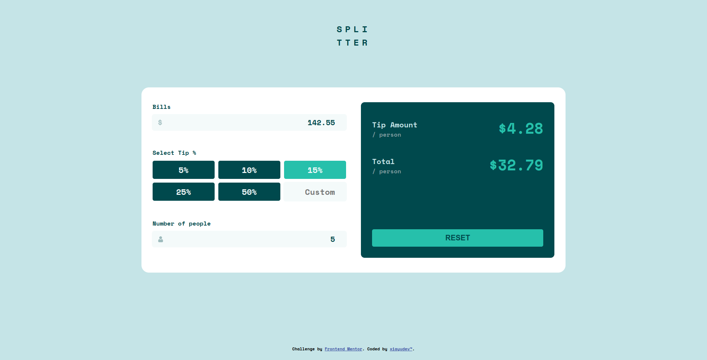

# Frontend Mentor - Tip calculator app solution

This is a solution to the [Tip calculator app challenge on Frontend Mentor](https://www.frontendmentor.io/challenges/tip-calculator-app-ugJNGbJUX). Frontend Mentor challenges help you improve your coding skills by building realistic projects.

## Table of contents

- [Frontend Mentor - Tip calculator app solution](#frontend-mentor---tip-calculator-app-solution)
  - [Table of contents](#table-of-contents)
  - [Overview](#overview)
    - [The challenge](#the-challenge)
    - [Screenshot](#screenshot)
    - [Links](#links)
  - [My process](#my-process)
    - [Built with](#built-with)
    - [What I learned](#what-i-learned)
    - [Continued development](#continued-development)
    - [Useful resources](#useful-resources)
  - [Author](#author)
  - [Recommended IDE Setup for running this project](#recommended-ide-setup-for-running-this-project)
  - [Type Support for `.vue` Imports in TS](#type-support-for-vue-imports-in-ts)
  - [Customize configuration](#customize-configuration)
  - [Project Setup](#project-setup)
    - [Compile and Hot-Reload for Development](#compile-and-hot-reload-for-development)
    - [Type-Check, Compile and Minify for Production](#type-check-compile-and-minify-for-production)
    - [Lint with ESLint](#lint-with-eslint)

## Overview

### The challenge

Users should be able to:

- View the optimal layout for the app depending on their device's screen size
- See hover states for all interactive elements on the page
- Calculate the correct tip and total cost of the bill per person

### Screenshot

- Mobile design 
- Desktop design 

### Links

- Solution URL: [Github](https://github.com/TheSunLand7/tip-calculator)
- Live Site URL: [Netlify](https://tip-calculator-fmentor-thesunland7.netlify.app/)

## My process

### Built with

- [PostCSS](https://github.com/postcss/postcss) - CSS Tool
- CSS custom properties
- Flexbox
- Mobile-first workflow
- CSS Grid
- [Vue.js](https://vuejs.org/) - Javascript Framework
- [Vite](https://vite.dev)
- [Typescript](https://typescriptlang.org/) - For Logic

### What I learned

I've learned how to comunicate through components in Vue, emit references and events to make app dinamic.

### Continued development

I am going to master working with Vue, Typescript and PostCSS.

### Useful resources

- [Vuejs Docs](https://www.vuejs.org) - This helped me to find answers to finish the app. It's a good and complete documentation.

## Author

- Website - [xiayudev](https://my-portfolio-v2-1.pages.dev/)
- Frontend Mentor - [@TheSunLand7](https://www.frontendmentor.io/profile/TheSunLand7)
- Twitter - [@J7Jeo](https://www.twitter.com/J7Jeo)

## Recommended IDE Setup for running this project

[VSCode](https://code.visualstudio.com/) + [Volar](https://marketplace.visualstudio.com/items?itemName=Vue.volar) (and disable Vetur) + [TypeScript Vue Plugin (Volar)](https://marketplace.visualstudio.com/items?itemName=Vue.vscode-typescript-vue-plugin).

## Type Support for `.vue` Imports in TS

TypeScript cannot handle type information for `.vue` imports by default, so we replace the `tsc` CLI with `vue-tsc` for type checking. In editors, we need [TypeScript Vue Plugin (Volar)](https://marketplace.visualstudio.com/items?itemName=Vue.vscode-typescript-vue-plugin) to make the TypeScript language service aware of `.vue` types.

If the standalone TypeScript plugin doesn't feel fast enough to you, Volar has also implemented a [Take Over Mode](https://github.com/johnsoncodehk/volar/discussions/471#discussioncomment-1361669) that is more performant. You can enable it by the following steps:

1. Disable the built-in TypeScript Extension
   1. Run `Extensions: Show Built-in Extensions` from VSCode's command palette
   2. Find `TypeScript and JavaScript Language Features`, right click and select `Disable (Workspace)`
2. Reload the VSCode window by running `Developer: Reload Window` from the command palette.

## Customize configuration

See [Vite Configuration Reference](https://vitejs.dev/config/).

## Project Setup

```sh
pnpm install
```

### Compile and Hot-Reload for Development

```sh
pnpm dev
```

### Type-Check, Compile and Minify for Production

```sh
pnpm build
```

### Lint with [ESLint](https://eslint.org/)

```sh
pnpm lint
```
